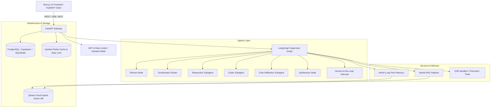

# Nexus AI Assistant — System Architecture

## Overview
Nexus AI Assistant is an enterprise-grade AI copilot built on a **Domain-Driven Design (DDD) Modular Monolith** architecture with FastAPI and LangGraph on the backend, and a Next.js 14 glassmorphic interface on the frontend.

## Core Modules & Boundaries

1. **Domain Layer (`backend/app/domain/`)**:
   - `user`: Identity, credentials, BYOK API key encryption (AES-256 Fernet), preferences.
   - `conversation`: Thread persistence, tree branching, multi-turn messages, attachments.
   - `file`: Document indexing metadata, chunk registries, vector IDs.
   - `tool`: Available tools registry, granular user permissions, audit execution logs.
   - `prompt`: Template catalog, version trees, system skills.
   - `usage`: Per-turn token usage, monthly cost tracking, DeepEval/Ragas score logs.
   - `system`: Dynamic system configuration, RFC-7807 exceptions, compliance audit trail.

2. **Agents Layer (`backend/app/agents/`)**:
   - `orchestrator`: Compiled StateGraph with `AsyncPostgresSaver` checkpointing, dynamic tool dispatching, and LangGraph HITL approval gates.
   - `subagents`: Specialized execution roles for web research (`researcher.py`), sandboxed python code execution (`coder.py`), and self-critique (`critic.py`).

3. **Hybrid RAG Pipeline (`backend/app/services/rag/`)**:
   - Ingests Markdown, PDF, Code, JSON.
   - Semantic sliding window chunking with header hierarchy preservation.
   - Dual-vector generation (dense BAAI/bge-small-en-v1.5 + sparse BM25).
   - Multi-stage retrieval with Reciprocal Rank Fusion (Fusion.RRF) and FlashRank cross-encoder reranking.
   - Grounded claim verification and citation attribution.
