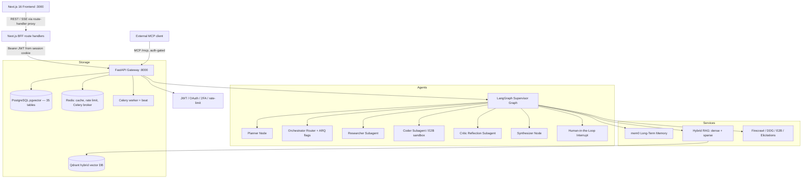

# Nexus AI Assistant — System Architecture

> Verified against the source at `1f43c89` (main). If this file contradicts the
> code, the code wins — update this file.

## Overview

Nexus AI Assistant is a full-stack AI copilot: a **FastAPI** backend built as a
**Domain-Driven Design (DDD) modular monolith** with a **LangGraph**
multi-agent orchestrator, and a **Next.js 16.3.4** (React 19.2.8) frontend that
talks to the API exclusively through BFF-style Next.js route handlers.

```mermaid
graph TD
    Browser[Next.js 16 Frontend :3000] -->|REST / SSE via route-handler proxy| BFF[Next.js BFF route handlers]
    BFF -->|Bearer JWT from session cookie| API[FastAPI Gateway :8000]
    MCPClient[External MCP client] -->|MCP /mcp, auth-gated| API
    API --> Auth[JWT / OAuth / 2FA / rate-limit]
    API --> Orc[LangGraph Supervisor Graph]

    subgraph Agents
        Orc --> Planner[Planner Node]
        Orc --> Router[Orchestrator Router + ARQ flags]
        Orc --> Researcher[Researcher Subagent]
        Orc --> Coder[Coder Subagent / E2B sandbox]
        Orc --> Critic[Critic Reflection Subagent]
        Orc --> Synth[Synthesizer Node]
        Orc --> HITL[Human-in-the-Loop Interrupt]
    end

    subgraph Services
        Orc --> Mem[mem0 Long-Term Memory]
        Orc --> RAG[Hybrid RAG: dense + sparse]
        Orc --> Tools[Firecrawl / DDG / E2B / Elicitations]
    end

    subgraph Storage
        API --> PG[(PostgreSQL pgvector — 35 tables)]
        RAG --> Qdrant[(Qdrant hybrid vector DB)]
        API --> RD[(Redis: cache, rate limit, Celery broker)]
        API --> Celery[Celery worker + beat]
    end
```

**97 API paths / 114 operations** are served under `/api/v1` (verified from the
live OpenAPI schema). Prometheus metrics are exposed at `/metrics`
(`include_in_schema=False`), and an auth-gated **FastMCP** server is mounted
at `/mcp` (`MCP_AUTH_ENABLED=True`, verified from the startup log).

## Core modules & boundaries

### Domain layer (`backend/app/domain/`)

One bounded context per folder, each with `models.py` (SQLModel tables),
`schemas.py` (Pydantic), `repository.py`, `service.py`:

- `user` — identity, credentials, BYOK provider keys (Fernet-encrypted),
  preferences, 2FA (TOTP), email verification.
- `conversation` — threads, `conversation_branches` (forking), messages,
  attachments, HITL approvals.
- `file` — `files`, `file_chunks`, `file_metadata` (RAG indexing metadata) and
  the 202-async indexing job pattern.
- `tool` — `tools`, `tool_permissions`, `tool_calls` (execution ledger).
- `prompt` — `prompt_templates`, `prompt_versions`, `skills`.
- `plan` / `artifact` — plan-then-approve mode and server-side versioned
  artifacts.
- `org` / `share` / `webhook` — organizations + invites + members, public
  conversation shares, outbound webhook endpoints + deliveries.
- `hook` — lifecycle hook policies (in-memory registry).
- `system` — `system_configs`, `audit_logs`, `api_keys`.
- `experiment` / `optimization` / `redteam` — bandits, prompt optimization
  runs, red-team probe runs.

**35 tables** total (verified: `SQLModel.metadata.tables` contains exactly
`api_keys, artifact_versions, artifacts, audit_logs, bandit_rewards,
conversation_branches, conversation_shares, conversations, cost_logs,
evaluation_logs, file_chunks, file_metadata, files, hook_policies,
message_attachments, messages, organization_invites, organization_members,
organizations, plans, prompt_optimization_runs, prompt_templates,
prompt_versions, redteam_runs, skills, system_configs, tool_calls,
tool_permissions, tools, usage_logs, user_memories, user_settings, users,
webhook_deliveries, webhook_endpoints`).

### API layer (`backend/app/api/v1/`)

Routers are thin: `auth, conversations, messages, audio, files, tools,
prompts, settings, usage, account, orgs, shares, webhooks, admin, evaluation,
plans, artifacts, metrics`, aggregated in `api.py` under `API_V1_PREFIX`
(`/api/v1`). Shared dependencies live in `deps.py`:

- `oauth2_scheme` (`tokenUrl=${API_V1_PREFIX}/auth/login`) + `get_current_user`
  — **Bearer JWT only**; the browser's `nexus_access_token` session cookie is
  converted into the Bearer header by the BFF proxy (`frontend/src/lib/proxy.ts`).
- `get_current_admin` — admin-only routes (users, hooks, monitoring, evals).
- `require_idempotency_key(scope)` — `Idempotency-Key` replay protection on
  mutating routes (guard class lives in `infrastructure/resilience/guards.py`).
- `get_storage()` — MinIO/S3-compatible file storage
  (`infrastructure/storage/supabase_storage.py`).

### Orchestration layer (`backend/app/agents/orchestrator/`)

LangGraph state graph: **planner → router → researcher/coder/critic →
synthesizer**. The router runs an ARQ (Attentive Reasoning Query) constraint
check before dispatch (needs_tool / safety_flag / recency_needed / ambiguous).
Checkpointing uses `AsyncPostgresSaver` + `InMemoryStore`, with full
**human-in-the-loop** support (interrupts surface via SSE events,
`POST /conversations/{id}/hitl` resolves them).

### Services layer (`backend/app/services/`)

- **RAG** (`services/rag/`): chunking, dense + sparse embeddings, Qdrant
  retrieval, hybrid fusion, BM25, FlashRank + sentence-salience reranking.
- **Monitoring** (`services/monitoring/`): drift monitor (sliding-window
  z-score + PSI), popularity-bucketed slices, fairness surface.
- **Evaluation** (`services/evaluation/`): deterministic offline heuristics
  (arena, conversational, quality, redteam) + LLM-judge gates
  (prompt-regression via LiteLLM).
- **Experiments/bandit/confidence/audit**: deterministic canary/shadow
  bucketing, ε-greedy bandits, calibrated confidence, EU-AI-Act audit surface.
- **Tools** (`services/tools/`): Firecrawl web search, DuckDuckGo, E2B code
  execution, structured elicitations wired into HITL.

### Infrastructure (`backend/app/infrastructure/`)

- `database/` — engine (imports **every** domain model for `create_all`),
  async session, Redis client.
- `qdrant.py`, `cache/` (response cache, rate-limit cache), `events/`
  (EventPublisher seam — a pluggable interface; the full transactional-outbox
  adapter is deliberately deferred, documented in `events/__init__.py`).
- `common/event_loop.py` — custom async event-loop factory; required on
  Windows via `uvicorn --loop backend.app.infrastructure.common.event_loop:event_loop_factory`.

## Data flow — a chat message

1. Frontend `ChatInput` → `POST /api/v1/conversations/{id}/messages/stream`
   (via the BFF proxy).
2. FastAPI validates the JWT (Bearer), rate-limits, checks the idempotency key,
   then hands off to the LangGraph graph.
3. The graph plans, routes, and dispatches to subagents/tools (Firecrawl, E2B,
   RAG, mem0) — tool events and HITL approval cards stream back over SSE.
4. `Synthesizer` composes the final answer (with numbered citations when RAG
   was used); responses are cached when the semantic-cost cache is enabled.
5. Usage is logged to `usage_logs`/`cost_logs` (`POST /usage/summary`
   aggregates for the UI).

## Streaming, auth, and security

- **SSE** — `POST /conversations/{conversation_id}/messages/stream` streams
  assistant deltas, thinking/CoT blocks, tool events, and HITL interrupts.
  `POST /conversations/{id}/messages` is the single-shot synchronous variant.
- **Auth** — JWT (HS256 only; signed + verified by jose), refresh tokens,
  optional TOTP 2FA, email verification, OAuth (GET `/oauth/login` for the
  provider URL, POST `/oauth/callback` for the code exchange).
- **MCP** — every `/mcp` request is gated by a middleware: Bearer JWT,
  `nexus_access_token` cookie, or `x-nexus-mcp-key` shared key.
- **Rate limiting & idempotency** — Redis-backed sliding-window limiter and
  the `IdempotencyGuard` middleware; failures are **fail-open** so an outage
  degrades latency/coverage but never bricks the request path.

## Reliability & observability

- Zero-dependency Prometheus `/metrics` endpoint renders the in-process
  `MetricsCollector` (families `nexus_requests_total`, `nexus_errors_total`,
  `nexus_latency_seconds`, `nexus_latency_avg_seconds`).
- SLOs, alerting rules, and runbooks are kept in sync across
  [`docs/slo.md`](slo.md), [`docs/alerting/alert-rules.yml`](alerting/alert-rules.yml),
  and [`docs/runbooks/`](runbooks/README.md).
- structlog structured logging with PII/secret redaction on every event.
- Celery worker handles async file indexing and eval dispatch; the response
  cache, rate limiter, and Redis client all fail open.

See also: [API reference](api-reference.md) · [Deployment](deployment-guide.md) ·
[SLOs](slo.md) · [User guide](user-guide.md) · root [`../AGENTS.md`](../AGENTS.md).